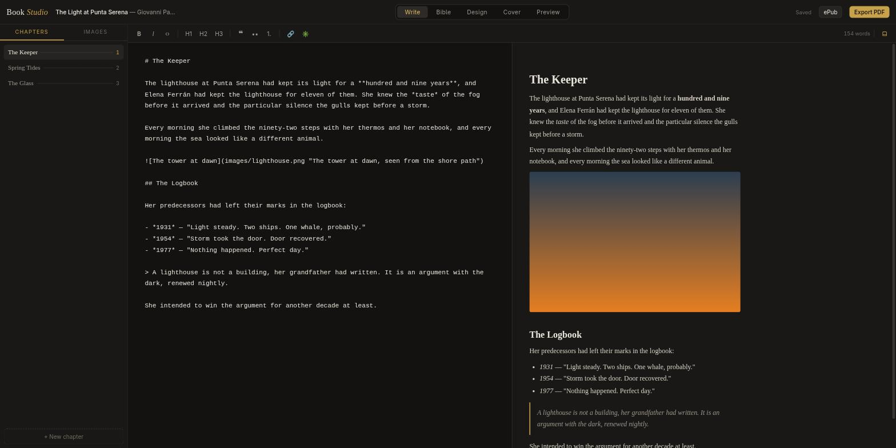
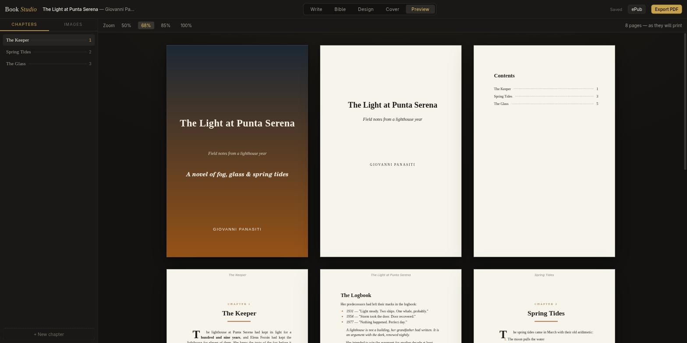
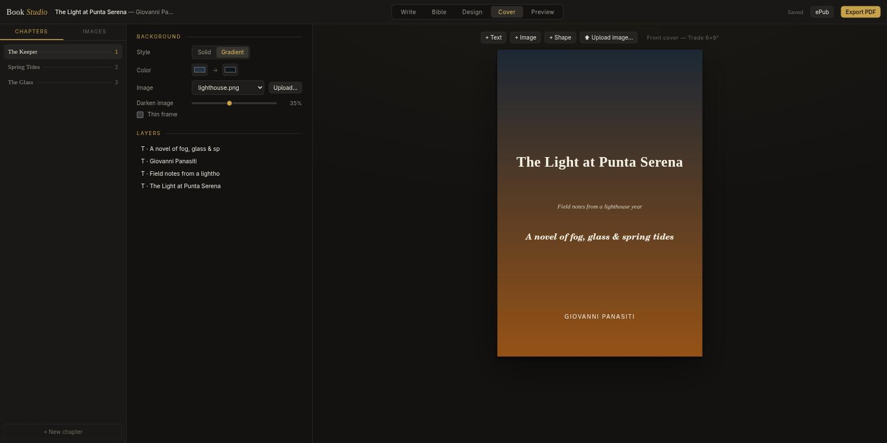
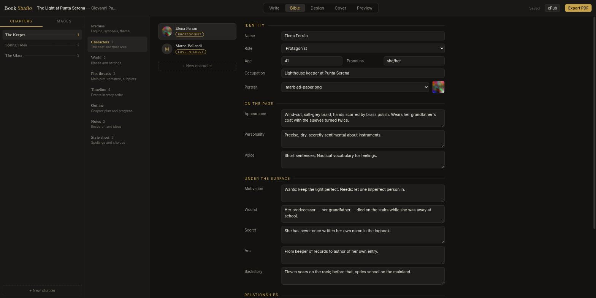
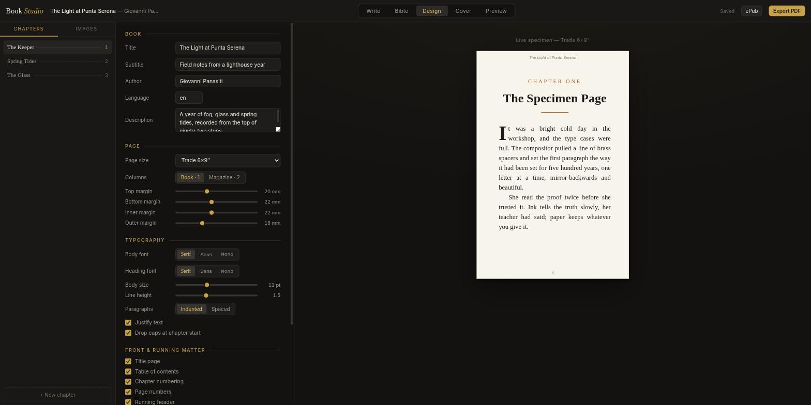

# Book Studio

Book Studio is a desktop application for the design and production of books and magazines.
You write the chapters in markdown, you set the typography, you design the cover, and you
export a print-ready PDF and an ePub.

Built with [Wails v2](https://wails.io) (Go backend) and React + TypeScript (frontend).

## Screenshots

*Write: markdown chapters with a live preview.*


*Preview: the whole book paginated as it will print — cover, title page, contents, drop caps and folios.*


*Cover: a freeform editor with text, images, shapes and every font installed on your system.*


*Story bible: characters with arcs and relationships, world, plot threads, timeline and outline.*


*Design: page, typography and front matter, with a live specimen page.*


## Features

- **Projects** — each book is a folder with `book.json`, `chapters/*.md` and `images/`.
  The welcome screen shows the recent projects.
- **Write** — a markdown editor with a formatting toolbar, a live preview, word count,
  keyboard shortcuts (Ctrl+B / Ctrl+I) and an editing context menu. Drag an image from
  the library into the text to insert it.
- **Chapters** — create, rename, duplicate, reorder (drag or context menu) and delete.
  The sidebar shows the chapters as a table of contents.
- **Images** — import images into the project, and use the image editor for crop,
  rotation, flip, brightness, contrast, saturation, grayscale, sepia and resize.
  Edits save as a new PNG copy.
- **Story bible** — everything a writer keeps beside the manuscript:
  - *Premise*: logline, full synopsis, theme, genre and audience.
  - *Characters*: role (protagonist, love interest, antagonist…), appearance, personality,
    voice, motivation, wound, secret, arc, backstory, portrait from the image library, and
    relationships between characters.
  - *World*: places with description, significance and a reference image.
  - *Plot threads*: main plot, romance and subplots, each with premise, stakes, resolution
    and a planned / active / resolved status.
  - *Timeline*: events in story order, with drag-free reordering from the context menu.
  - *Outline*: a card for each chapter with synopsis, point-of-view character, status
    (idea / draft / revising / done), word target and live word count, plus a book-level
    word target with a progress bar.
  - *Notes*: research, worldbuilding and idea cards.
  - *Style sheet*: the editorial record of spellings and naming decisions.
  The bible is stored in `bible.json` inside the project and is never exported with the book.
- **Design** — page size (Trade, Digest, A5, A4, Letter, Magazine, Square), margins,
  one or two columns, body and heading fonts, size, line height, paragraph style,
  justification, drop caps, colors, and front matter (title page, table of contents,
  chapter numbers, page numbers, running header). A live specimen page shows each change.
- **Cover** — a freeform cover editor. Add text, images and shapes; drag, resize, rotate
  and layer them on the canvas; right-click for duplicate, layer order and delete.
  Text elements can use any **system font** (the app scans your installed fonts) plus the
  three built-in stacks. Backgrounds: solid, gradient, or an image with a darkening
  overlay — and you can **upload images** straight from the cover editor.
  On export the cover is rendered at 300 dpi and used as-is in the PDF and the ePub, so
  the exported cover is exactly what you designed. Older projects migrate automatically:
  the fixed title, subtitle and author become editable elements.
- **Preview** — the full book, paginated as it will print: cover, title page, table of
  contents with page numbers, running headers, folios and drop caps.
- **Export PDF** — a real typesetting engine: justified text with bold, italic, code and
  links, images with captions, lists, quotations, code blocks, scene breaks, drop caps,
  mirrored margins, one or two columns, running headers, page numbers, and a table of
  contents with correct page numbers (two-pass layout).
- **Export ePub** — a valid EPUB 3 package with XHTML chapters, navigation document,
  NCX fallback, cover, stylesheet from your design settings, and all images.
- **Native menu** — File (new, open, save, export), View (the four views) and Help.

## Download

Prebuilt packages for **macOS** (universal), **Windows**, **Debian/Ubuntu**
(.deb) and **Linux** (portable tar.gz) are on the
[releases page](https://github.com/giovapanasiti/book_studio/releases).

Maintainers: `make release` builds the Linux, .deb and Windows artifacts;
`make publish` tags the version, creates the GitHub release and uploads
them; the macOS build is added by CI (`.github/workflows/release.yml`).

## Install on Arch Linux

The repository contains a `PKGBUILD`. From the repository root:

```sh
makepkg -si
```

This builds the app, packages it, and installs it with pacman: the `book-studio`
command, a menu entry and the icon. Remove it with `sudo pacman -R book-studio`.

Build dependencies: `go`, `nodejs`, `npm` (from the repositories). The Wails CLI is
used when it is on the PATH; if it is not, the build installs a private copy.

## Build

Requirements: Go 1.25+, Node.js 18+, the Wails CLI, and on Linux `webkit2gtk-4.1` and GTK 3.

```sh
go install github.com/wailsapp/wails/v2/cmd/wails@latest
wails build -tags webkit2_41
```

The binary is written to `build/bin/book-studio`.

## Develop

```sh
wails dev -tags webkit2_41
```

## Test

The export engines have tests:

```sh
go test -tags webkit2_41 ./...
```

## Project format

```
my-book/
  book.json        # title, author, chapters, design styles, cover design
  bible.json       # story bible: characters, world, plot, outline, notes
  cover.png        # 300 dpi render of the cover, written before each export
  chapters/*.md    # one markdown file for each chapter
  images/          # all images; reference them as images/<name> in markdown
```

A sample project is included in `sample-book/`.
